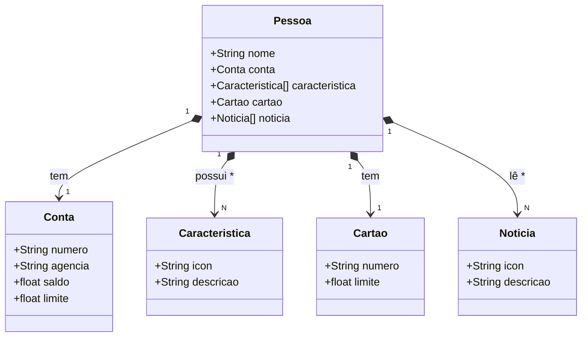

# Desafio final

## Diagrama de classes

```mermaid

classDiagram
    class Pessoa {
        +String nome
        +Conta conta
        +Caracteristica[] caracteristica
        +Cartao cartao
        +Noticia[] noticia

    }

    class Conta {
        +String numero
        +String agencia
        +float saldo
        +float limite
    }

    class Caracteristica {
        +String icon
        +String descricao
    }

    class Cartao {
        +String numero
        +float limite
    }

    class Noticia {
        +String icon
        +String descricao
    }

    Pessoa "1" *--> "1" Conta : tem
    Pessoa "1" *--> "N" Caracteristica : possui *
    Pessoa "1" *--> "1" Cartao : tem
    Pessoa "1" *--> "N" Noticia : lê *

```
